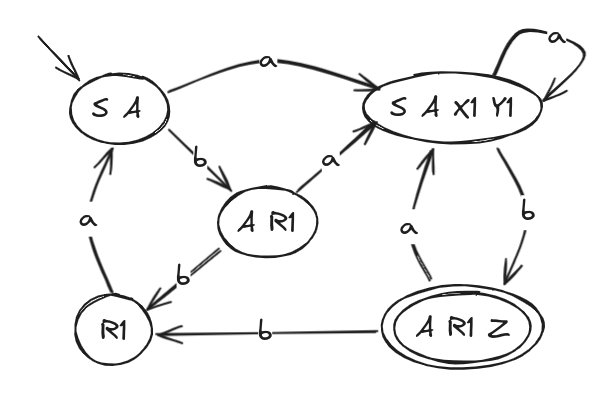
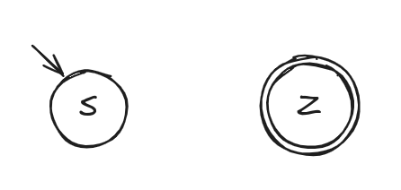
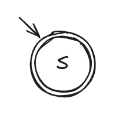
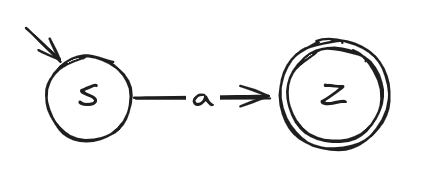
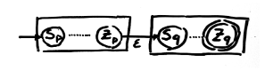
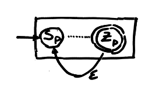
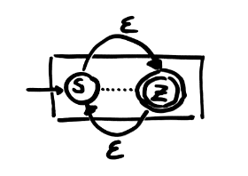

# Automata

An automata is a 5 component object where: 

- T is the alphabet
- Q is a set o states
- S is the initial state
- Z is the final state
- δ is the state transition function

## Non-deterministic Automata (AND)

A non-deterministic automata, its an automata in which the state transition function is given a certain state and a symbol of the alphabet. As a result it shall give us a set of states.

### GSR to AND

Let's consider the following GSR:
```
S → I | E
I → A | ’+’ A | ’-’ A
A → d Z | d A
E → ’+’ F | ’-’ F | F
F → d F | d X1
X1 → ’.’ A
Z → ε
```

Analysing it we can determine the following AND:


## Deterministic Automata (AD)

A deterministic automata is an automata in which the state transition function is given a certain state and a symbol of the alphabet. As a result it gives back a state.

### AND to AD

Let take into account the following grammar and automata:
```
S → A | a S | b A
A → a X1| a Y1| b R1
X1 → b Z
Y1 → b A
R1 → a S
Z → ε
```


A viable method to transform an AND to an AD is using a table:
| State | a | b | 
| :---: | :---: | :---: |
| S,A | S,A,X1,Y1 | A,R1 |
| S,A,X1,Y1 | S,A,X1,Y1 | A,R1,Z |
| A,R1 | X1,Y1,S,A | R1 |
| A,R1,Z | X1,Y1,S,A | R1 |
| R1 | S,A | |

Having this table we can reproduce the following AD automata:


### Regex to AND

A thing about regular expressions is that we can also convert them into AND automata.

Here are the following

1. e = φ



2. e = ε



3. e = a



4. e = p + q (p and q are regular expressions)


5. e = p . q



6. e = p+



7. e = p*



<hr></hr>

##### Next Chapter: [Recognition Top-Down](recognitio-top.md)
