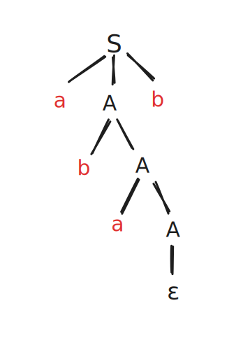

---
title: Grammars (Part I)
--- 

# Grammars (Gramáticas)

A grammar can be defined by the following

- T - It's alphabet a set of terminal symbols
- N - A set of non-terminal symbols
- S - The starting symbol
- P - A set of productions

A productions is a tuple (a,b) and we write them as a -> b.
Give an a -> b production, a is the right side, while b is the left side of the production.

Lets look at a simple grammar to represent real numbers:

```
S -> Sinal Mantissa Expoente
Sinal -> + | - | ε
Mantissa -> Dígitos Meio Dígitos
Dígitos -> ε | Dígito Dígitos
Meio -> Dígito . | . Dígito
Dígito -> 0 | ... | 9
Expoent -> ε | 'E' Sinal Dígitos DígGrammars (Part I)itos
```

One of the key ideas when writing a grammar is to identify the blocks that constitute the string and associate them a non-terminal symbol.

### Derivation Trees

From a grammar we can obtain a derivation tree.
Take for example this grammar 

``` 
S -> a A b
A -> ε | a A | b A
```

From it we want to get _abab_.
Knowing this, we get the following derivation tree.



## Regular Grammars (GR)

A context independent grammar can be defined as regular to the right or to the left. This is defined by the way the productions are defined.

### To the Right

The productions are defined this way.
```
A -> y
A -> y B
``` 
Where y is a T. Being said this, all productions have on their right side, at max, one non-terminal symbol.


### To the Left

The productions are defined this way.
```
A -> y
A -> B y
``` 
Where y is a T. Being said this, all productions have on their left side, at max, one non-terminal symbol. This one being the first symbol on the right side.

## Regex to Grammars

For each non-terminal symbol A where the productions are defined this way.

```
A -> a1 | a2 | ... | an
```
We can right the following equation
```
A = o1 + o2 + ... + on
```
Where oi corresponds to the ai.

Taking into account this simple grammar:

```
S → Sinal RealSemSinal
Sinal → ε| + |−
RealSemSinal → Inteiro ParteDecimal
Inteiro → digito | digito Inteiro
ParteDecimal → ε| ’.’ Inteiro
```
We can define the following equations:
```
S = Sinal RealSemSinal
Sinal = ε + ’+’ + ’-’
RealSemSinal = Inteiro ParteDecimal
Inteiro = digito + digito Inteiro
ParteDecimal = ε + ’.’ Inteiro
```

The solution being `S = (ε + '+' + '-')(digito)+ (ε + '.' (digito)+)`

## Simple Regular Grammars (GSR)

### To the Right

All of the productions follow this logic:
```
A -> a B
```
With the exception of 
```
Z -> ε
```

### To the Left


All of the productions follow this logic:
```
A -> B a
```
With the exception of 
```
Z -> ε
```

For both cases Z is the final symbol.

### GR to GSR

<hr></hr>

##### Next Chapter: [Grammars (Parte II)](automata.md)


