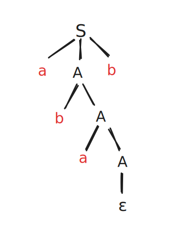

---
title: Grammars
--- 

# Grammars (Gramáticas)

A grammar can be defined by the following

- T - It's alphabet a set of terminal symbols
- N - A set of non-terminal symbols
- S - The starting symbol
- P - A set of productions

A productions is a tuple (a,b) and we write them as a -> b.
Give an a -> b production, a is the right side, while b is the left side of the production.

Lets look at a simple grammar to represent real numbers:

```
S -> Sinal Mantissa Expoente
Sinal -> + | - | ε
Mantissa -> Dígitos Meio Dígitos
Dígitos -> ε | Dígito Dígitos
Meio -> Dígito . | . Dígito
Dígito -> 0 | ... | 9
Expoent -> ε | 'E' Sinal Dígitos Dígitos
```

One of the key ideas when writing a grammar is to identify the blocks that constitute the string and associate them a non-terminal symbol.

### Derivation Trees

From a grammar we can obtain a derivation tree.
Take for example this grammar 

``` 
S -> a A b
A -> ε | a A | b A
```

From it we want to get _abab_.
Knowing this, we get the following derivation tree.



## Regular Grammars (GR)

A context independent grammar can be defined as regular to the right or to the left. This is defined by the way the productions are defined.

## Regex to Grammars


