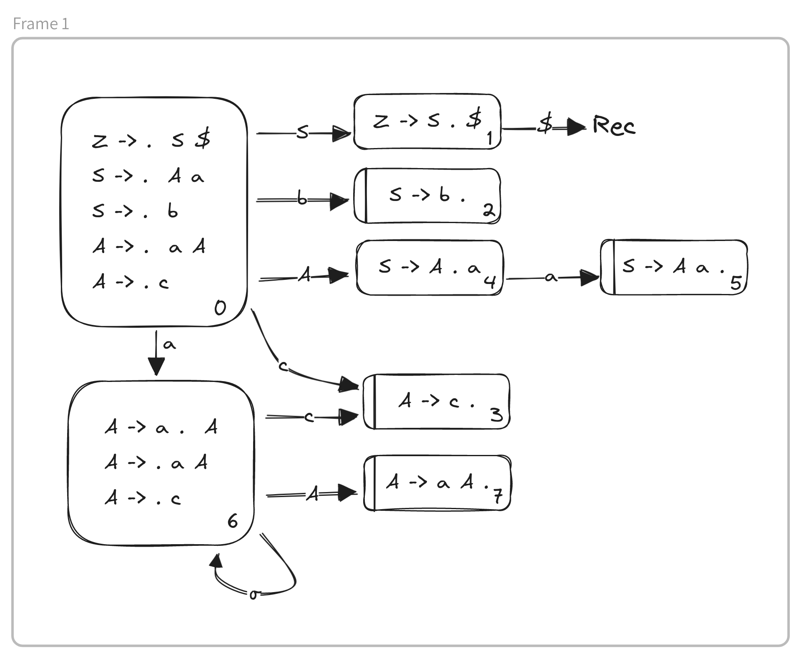

# Recognition Bottom-Up

This method of recognition basis itself in **conclusions**, basically, the interpretation that was give to the string to be analysed. These conclusions will be a sequence of non-terminal and terminal symbols.

To begin with, we have nothing in sequence. When we analyse a new symbol we add it to the conclusions. To this process we call _transaction_. Sometimes we are able to substitute a set of symbols from the conclusions for a non-terminal symbol that represents the set. To this process we call it a _reduction_.

To sum up, this method basis itself in the following actions:
- Transition -> Accepts the next terminal symbol and adds it to the conclusions
- Reduction -> Substitutes a sufix alpha, belonging to the conclusions, for a non-terminal symbol A (A -> alpha)
- Acceptance -> Next symbol => $ and conclusions => <\axiom>
- Error -> It's not possible to reduce or transition

## LR0 Automata 

To decide which action to do in each situation, the decision will be based on automata that describes the situation. Each automata LR0 will describe the situation and sequence of conclusions that is associated to a route.

Let's take into account the following automata:
```
Z -> S $
S -> A a
   | b
A -> a A
   | c
```
The inicial item will be `[Z -> . S $]`.
When the position is before a non-terminal symbol the derived production of the non-termial symbol are also parte of the state (`.` is the current position).
Therefore `[S -> . A a]` and `[S -> . b]`, as well as, `[A -> . a A]` and `[A -> . c]`. The following states will be obtained by advancing the position one symbol.



The items in which the position is at the end are called reduction items. the items in which the position is imediatly before a terminal symbol are called transition terminal items, while the others are called transition non-terminal items.

| | $ | a | b | c | | S | A |
| :---: | :---: | :---: | :---: | :---: | :---: | :---: | :---: |
|0 | | 6 | 2 | 3 | | 1 | 4 |
|1| rec | | | | | | | |
|2| P2 | P2 | P2 | P2 | | | |
|3| P4 | P4 | P4 | P4 | | | |
|4| | 5 | | | | | |
|5| P1 | P1 | P1 | P1 | | | |
|6| | 6 | | 3 | | | 7 |
|7| P3 | P3 | P3 | P3 | | | |

Caption:
- Empty -> error
- rec -> recognition
- Pn -> Reduction by the Production n
- n -> Transition for the state n

Now for the _aaca_ string we do the following table

| route | conclusions | string | action | tree |
| :--- | :---: | :---: | :---: | :---: |
| 0 | | aaca$ | Trans a 6 | a a c a $ |
| 06 | a | aca$ | Trans a 6 | |
| 066 | aa | ca$ | Trans c 3 | |
| 0663 | aac| a$ | Reduc P4 | A |
| 066 | aaA | a$ | Trans A 7 | |
| 0667 | aaA | a$ | Reduc P3 | A |
| 06 | aA | a$ | Trans A 7 | |
| 0 | A | a$ | TransNT A 4 | |
| 04 | A | a$ | Trans a 5 | |
| 045 | Aa | $ | Reduc P1 | S |
| 01 | S | $ | Recognition | |

### LR0 Conflicts

In LR0 there are two different conflicts, reduce-reduce and transition-reduce.
Reduce-reduce is when in a state there are two items with different reductions. Meanwhile transition-reduce, is when there is an item of reduction and an item of transition for a terminal symbol.

## SLR1 Automata

### SLR1 Conflicts Reduce-Reduce

### SLR1 Conflicts Transition-Reduce

## LALR1 Automata

### LALR1 Conditions

### LALR1 Conflicts Reduce-Reduce

### LALR1 Conflicts Transition-Reduce

<hr></hr>

##### Extras: [Exercises](exercises.md)
